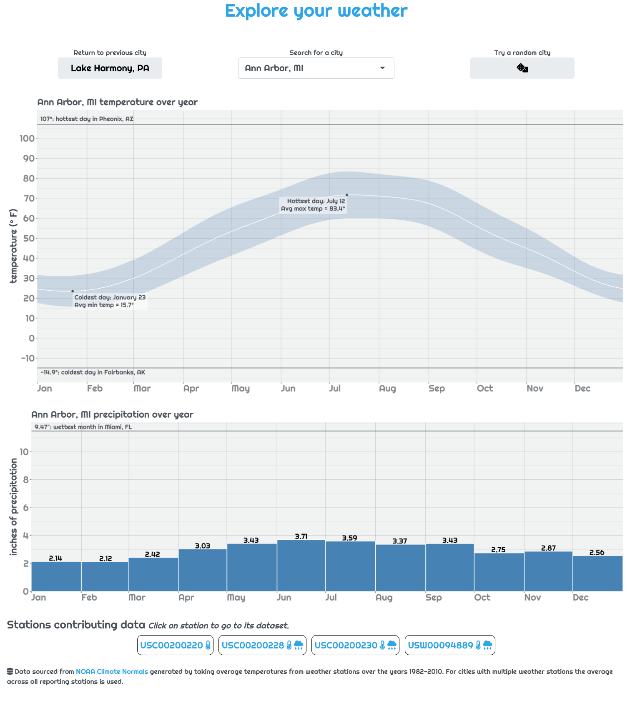
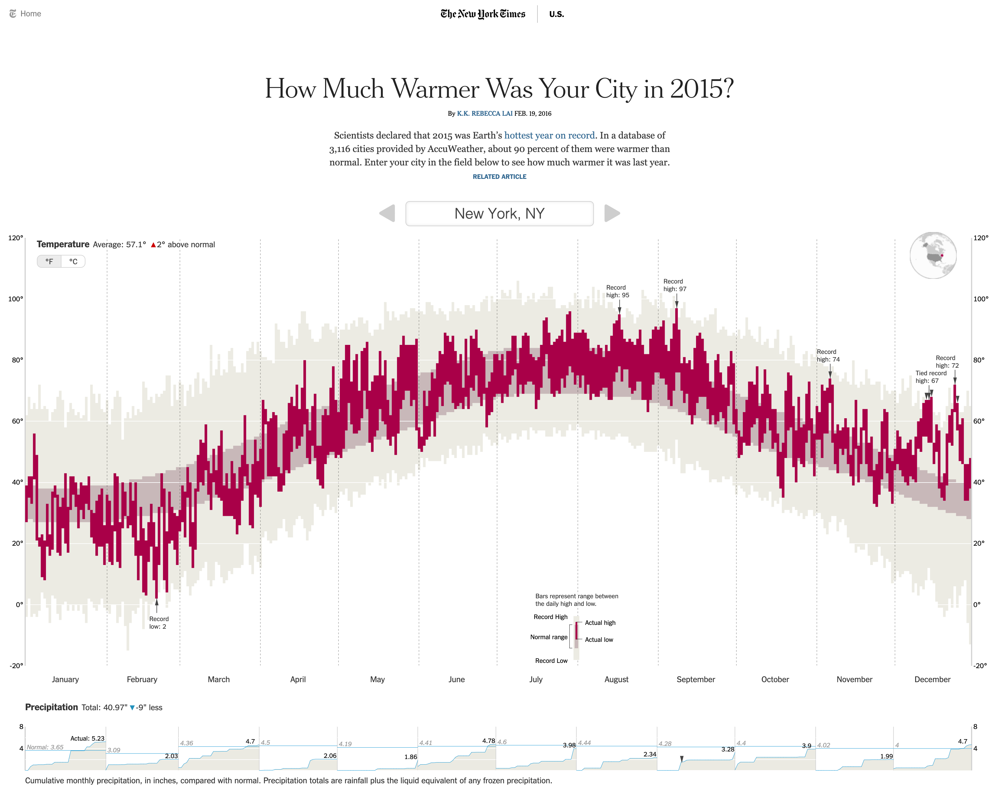
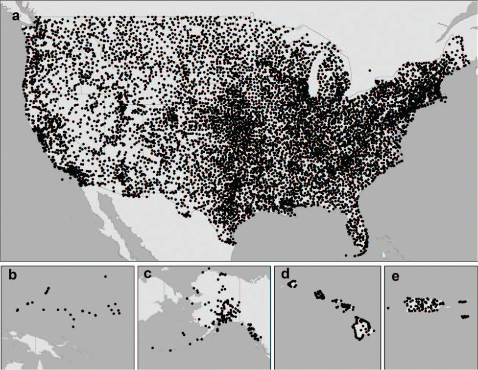
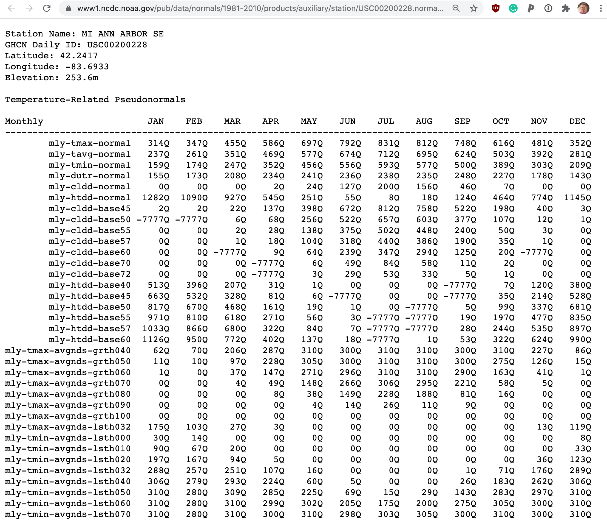

```{r setup, include=FALSE}
library(flair)
knitr::opts_chunk$set(echo = FALSE)

city_data_color <- "#984ea3"
data_color <- "#4daf4a"
temp_color <- "#ff7f00"
prcp_color <- "#377eb8"

city_data <- flair_all("city_data()", color = city_data_color, before = "<code>", after = "</code>")
```

<style>
.centered_img {
  text-align:center;
  margin: 0.25em;
}
.centered_img img {
  box-shadow: 1px 1px 6px black;
  margin: 0.1em;
}
</style>

## Summary

The "Explore your weather" app allows a user to lookup a city of choice and see what the "normal" temperature and precipitation is for that city over the year. It takes advantage of new features in Shiny 1.6 that make it easier than ever to make fast and good looking apps with R. 


<div class = "centered_img"> 
 

_Screenshot of the weather lookup app._
</div>


## What the app does

The goal for the app is to be a tool to quickly get a broad-level grasp of the weather in a given city. Users should be able to answer questions like "how hot is a typical March day?" and "what's the wettest month?" for their city of choice. 

## Inspiration for app

Inspiration for the design came from the story ["How Much Warmer Was Your City in 2015?"](https://www.nytimes.com/interactive/2016/02/19/us/2015-year-in-weather-temperature-precipitation.html#new-york_ny) in the New York Times, by [K.K. Rebecca Lai.](https://www.nytimes.com/by/kk-rebecca-lai) 


<div class = "centered_img"> 
<a href = "https://www.nytimes.com/interactive/2016/02/19/us/2015-year-in-weather-temperature-precipitation.html">
 
</a>

[_New York Times article providing inspiration for app design._](https://www.nytimes.com/interactive/2016/02/19/us/2015-year-in-weather-temperature-precipitation.html)
</div>

While the inspiration is obvious, our app isn't a _direct_ copy. Our focus is more on getting a general idea of typical weather rather than comparing to a given year. Also, unlike the NYTimes article that uses javascript, our app is written completely in R (with a tiny bit of CSS). 


## NOAA Temperature Normals

The data driving the application comes from the [National Oceanic and Atmospheric Association (NOAA)](https://www.noaa.gov/). In the NOAA's open data portal they have a set of data for ["climate normals."](https://www.ncdc.noaa.gov/data-access/land-based-station-data/land-based-datasets/climate-normals) These data provide the "normal" or typical values of various climate measures for ~9.7 thousand weather stations around the US based on readings from 1981 to 2010. 

<div class = "centered_img"> 
 

_All stations present in NOAA Normals database. Figure from Bulletin of the American Meteorological Society 93, 11; 10.1175/BAMS-D-11-00197.1_
</div>

The way the data are stored place all the data for a given station within a text document located at an HTTP endpoint. For instance, the normals data for station <code><span style='color:forestgreen;'>USC00200228</span></code> located in Ann Arbor, MI is available at the endpoint 
[<code>https://www1.ncdc.noaa.gov/pub/data/normals/1981-2010/products/auxiliary/station/<span style='color:forestgreen;'>USC00200228</span>.normals.txt</code>](https://www1.ncdc.noaa.gov/pub/data/normals/1981-2010/products/auxiliary/station/USC00200228.normals.txt)


<div class = "centered_img"> 
 

_Example of the first few lines of data for a station._

_To see the data going into any given app-view check out the "Stations contributing data" section of the app below the plots._
</div>

 

There are lots of interesting measures available in these "normals" but what our app focuses on is the temperature (daily minimum, average, maximum) and precipitation (monthly totals). If you want more info on these data take a look at the [NOAA landing page](https://www.ncdc.noaa.gov/data-access/land-based-station-data/land-based-datasets/climate-normals/1981-2010-normals-data) or [the scientific manuscript accompanying them.](https://journals.ametsoc.org/view/journals/bams/93/11/bams-d-11-00197.1.xml) 


## App flow

When thinking about how a Shiny app works it helps to think about the main important reactive variables/expressions: what they depend on and what depends on them. Our app is relatively simple, with one main `reactive()` variable, an output plot, and some dynamic UI to show information about stations within a city.

### `r city_data` reactive

The state of the app centers around the currently selected city. When a city is selected, the app then reaches out to the NOAA servers and `r flair_all("downloads the data for every station", color = data_color)` residing in that city. From this data the `r flair_all("temperature", color = temp_color)` and `r flair_all("precipitation", color = prcp_color)` normals are extracted and averaged together to give an "averaged average" portrait of the city's weather. The results of this querying and parsing is stored in the `reactive` value `r city_data`...

```{r, echo = FALSE}
decorate('hefty-reactive') %>% 
  flair("city_data", color = city_data_color) %>% 
  flair("mutate(url = build_station_url(station),
               data = map(url, possibly(readr::read_file)))", color = data_color) %>% 
  flair("stations$temp_res <- map(stations$data, possibly(get_temp_data))", color = temp_color) %>% 
  flair("stations$prcp_res <- map(stations$data, possibly(get_prcp_data))", color = prcp_color)
```

```{r hefty-reactive, eval = FALSE}
server <- function(input, output, session) {
  ...
  city_data <- reactive({
    ...
    withProgress(message = 'Fetching data from NOAA', {
      stations <- filter(station_to_city, city == input$city)
      
      ...
      # Not every station has both temperature and precipitation data. To deal
      # with this, loop through all stations in a city try to extract whatever
      # data is present. If a city has a lot of stations, like Fairbanks, AK,
      # this this can take a while
      incProgress(1/4, detail = "Downloading data from all found stations")
      stations <- stations %>%
        mutate(url = build_station_url(station),
               data = map(url, possibly(readr::read_file)))
      # purrr::possibly allows bad requests to fail without crashing app 
      
      ...
      incProgress(2/4, detail = "Extracting temperature data")
      stations$temp_res <- map(stations$data, possibly(get_temp_data))
      temperature <- collapse_stations(stations$temp_res)

      ...
      incProgress(3/4, detail = "Extracting precipitation data")
      stations$prcp_res <- map(stations$data, possibly(get_prcp_data))
      precipitation <- collapse_stations(stations$prcp_res)

      ...
  })})
    
  ...
}
```

_See full code on [github](https://github.com/rstudio/shiny_showcase/blob/master/weather_lookup/app.R#L96-L133)_


### `output$weather_plot`

The main centerpiece of the app is the output plot. This plot is actually two separate ggplots that are generated using the data stored in `r city_data` reactive. 

One of the plots shows temperature and the other shows precipitation. Both of these plots are themselves complex `ggplot2` objects, with many layers and annotations. Full ggplot code to generate each plot is available on github: [temperature,](https://github.com/rstudio/shiny_showcase/blob/master/weather_lookup/helpers.R#L112-L152) [precipitation](https://github.com/rstudio/shiny_showcase/blob/master/weather_lookup/helpers.R#L79-L110).

In order to keep the results of the app as a single image that can be copied and shared the R package `patchwork` is used to set both plots on top of each-other. This means that just a single `renderPlot()` is needed. 

<div class = "centered_img"> 
 

_Example output of plots generated by app_
</div>


### `output$station_info`

To let user's see exactly what weather stations went into generating their city's averaged weather a small panel is provided beneath the plot that lays out the long-and-complicated station id along with the types of data contributed by that station.  

```r
output$station_info <- renderUI({
  # Let the user know what stations went into the plot they're seeing and
  # allow them to explore the data directly
  pmap(city_data()$station_info,
       function(url, station, had_temp, had_prcp, ...){
         div(class = "station_bubble",
             a(href = url, target = "_blank",
               station, if(had_temp) icon('thermometer-half'), if(had_prcp) icon('cloud-rain')))
       })
})
```

This pane is generated with series of `div` tags inserted into the app using the dynamic UI generation functions `renderUI()` and `uiOutput()`. The number and contents of these tags depends on the results contained in the `city_data()` reactive. 

<div class = "centered_img"> 
 

_Example station info for Ann Arbor, MI. Notice that the first station is missing precipitation data._
</div>


### Previous city button

A lot of times one may be interested in comparing the weather between two cities. A previous city button allows this interaction. the button simply sets the city to the city viewed just before the current city. To quickly toggle back and forth between two cities to see the differences the user simply needs to tap the button repeatedly. 

<div class = "centered_img" style = "width: 70%; margin: 0 auto;"> 

<video width="100%" controls="controls" style = "margin: 0 auto; display: block;">
<source src="previous_city_button.webm" type="video/webm">
</video>


_The previous city button lets the user quickly toggle between two cities to compare them._
</div>


## Learning more

Now that we have introduced the app. Checkout the followup articles that detail how the app uses caching to provide a speedy user experience and how we give the app a bespoke look with the `bslib` package (coming soon).

Also be sure to checkout the [github repo with all the apps code.](https://github.com/rstudio/shiny_showcase/tree/master/weather_lookup)


