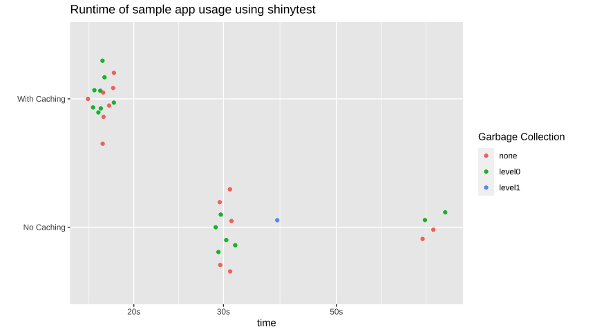

```{r setup, include=FALSE}
library(flair)
knitr::opts_chunk$set(echo = FALSE)

city_data_color <- "#984ea3"
data_color <- "#4daf4a"
temp_color <- "#ff7f00"
prcp_color <- "#377eb8"

city_data <- flair_all("city_data()", color = city_data_color, before = "<code>", after = "</code>")
```

<style>
.centered_img {
  text-align:center;
  margin: 0.25em;
}
.centered_img img {
  box-shadow: 1px 1px 6px black;
  margin: 0.1em;
}

</style>

## Summary

Here we demonstrate the use of the new `bindCache()` function in Shiny to greatly speedup a Shiny app that queries an NOAA weather station data API. The use of caching not only speeds up the app for end users but relieves pressure from the API. In this post we will demonstrate the adding of `bindCache` to existing reactive expressions, explaining where and why it should be used along with some potential gotchas of doing so. 

## Demo App

To demonstrate the benefits of caching we have built a shiny app that allows the user to look up the typical temperature range and precipitation amounts across a year. 


<div class = "centered_img"> 
 

_Screenshot of the weather lookup app._
</div>


### NOAA Temperature Normals

The data driving the application comes from the [National Oceanic and Atmospheric Association (NOAA)](https://www.noaa.gov/). In the NOAA's open data portal they have a set of data for ["climate normals."](https://www.ncdc.noaa.gov/data-access/land-based-station-data/land-based-datasets/climate-normals) These data provide the "normal" or typical values of various climate measures for ~9.7 thousand weather stations around the US based on readings from 1981 to 2010. 

The way the data are stored place all the data for a given station within a text document located at an HTTP endpoint. For instance, the normals data for station <code><span style='color:forestgreen;'>USC00200228</span></code> located in Ann Arbor, MI is available at the endpoint 
[<code>https://www1.ncdc.noaa.gov/pub/data/normals/1981-2010/products/auxiliary/station/<span style='color:forestgreen;'>USC00200228</span>.normals.txt</code>](https://www1.ncdc.noaa.gov/pub/data/normals/1981-2010/products/auxiliary/station/USC00200228.normals.txt)


<div class = "centered_img"> 
 

_Example of the first few lines of data for a station_
</div>


There are lots of interesting measures available in these "normals" but what our app focuses on is the temperature (daily minimum, average, maximum) and precipitation (monthly totals). If you want more info on these data take a look at the [NOAA landing page](https://www.ncdc.noaa.gov/data-access/land-based-station-data/land-based-datasets/climate-normals/1981-2010-normals-data) or [the scientific manuscript accompanying them.](https://journals.ametsoc.org/view/journals/bams/93/11/bams-d-11-00197.1.xml) 


### Inspiration for app

The goal for the app was to build a tool to quickly get a broad-level grasp of the weather in a given city. Questions such as "How hot does it get?" and "what's the wettest month?". An inspiration for the design came from the story ["How Much Warmer Was Your City in 2015?"](https://www.nytimes.com/interactive/2016/02/19/us/2015-year-in-weather-temperature-precipitation.html#new-york_ny) in the New York Times, by [K.K. Rebecca Lai.](https://www.nytimes.com/by/kk-rebecca-lai) 


<div class = "centered_img"> 
<a href = "https://www.nytimes.com/interactive/2016/02/19/us/2015-year-in-weather-temperature-precipitation.html">
 
</a>

[_New York Times article providing inspiration for app design._](https://www.nytimes.com/interactive/2016/02/19/us/2015-year-in-weather-temperature-precipitation.html)
</div>


### App flow

#### `r city_data` 
The state of the app centers around the currently selected city. When a city is selected, the app then reaches out to the NOAA servers and `r flair_all("downloads the data for every station", color = data_color)` residing in that city. From this data the `r flair_all("temperature", color = temp_color)` and `r flair_all("precipitation", color = prcp_color)` normals are extracted and averaged together to give an "averaged average" portrait of the city's weather. This parsed data is then stored in `reactive` value called `r city_data`...

```{r, echo = FALSE}
decorate('hefty-reactive') %>% 
  flair("city_data", color = city_data_color) %>% 
  flair("mutate(url = build_station_url(station),
               data = map(url, possibly(readr::read_file)))", color = data_color) %>% 
  flair("stations$temp_res <- map(stations$data, possibly(get_temp_data))", color = temp_color) %>% 
  flair("stations$prcp_res <- map(stations$data, possibly(get_prcp_data))", color = prcp_color)
```

```{r hefty-reactive, eval = FALSE}
server <- function(input, output, session) {
  ...
  city_data <- reactive({
    ...
    withProgress(message = 'Fetching data from NOAA', {
      stations <- filter(station_to_city, city == input$city)
      
      ...
      # Not every station has both temperature and precipitation data. To deal
      # with this, loop through all stations in a city try to extract whatever
      # data is present. If a city has a lot of stations, like Fairbanks, AK,
      # this this can take a while
      incProgress(1/4, detail = "Downloading data from all found stations")
      stations <- stations %>%
        mutate(url = build_station_url(station),
               data = map(url, possibly(readr::read_file)))
      # purrr::possibly allows bad requests to fail without crashing app 
      
      ...
      incProgress(2/4, detail = "Extracting temperature data")
      stations$temp_res <- map(stations$data, possibly(get_temp_data))
      temperature <- collapse_stations(stations$temp_res)

      ...
      incProgress(3/4, detail = "Extracting precipitation data")
      stations$prcp_res <- map(stations$data, possibly(get_prcp_data))
      precipitation <- collapse_stations(stations$prcp_res)

      ...
  })})
    
  ...
}
```

_See full code on [github](https://github.com/rstudio/shiny_showcase/blob/master/weather_lookup/app.R#L96-L133)_

This is a computationally intensive reactive value that does a lot of work. 

#### Plots

Two plots are generated using the data stored in `r city_data`. The first showing temperature and the second showing precipitation. These plots are themselves complex `ggplot2` objects, with many layers and annotations. Full ggplot code to generate each plot is available on github: [temperature,](https://github.com/rstudio/shiny_showcase/blob/master/weather_lookup/app.R#L149-L204) [precipitation](https://github.com/rstudio/shiny_showcase/blob/master/weather_lookup/app.R#L207-L252).


<div class = "centered_img"> 
 

_Example output of plots generated by app_
</div>


#### Previous city button

A lot of times one may be interested in comparing the weather between two cities. This is made easier in the app by having a previous city button. This button simply sets the city to the city viewed just before the current city. This enables quick toggling back and forth between two cities to see the differences. 


<div class = "centered_img"> 
 
</div>


## Performance

While this application we've built is interesting and potentially useful, it can be a bit slow. This is because the querying of the NOAA API is typically a slow process and may need to be repeated many times for cities with lots of stations. Along with the time the `city_data()` reactive takes, each one of the plots takes a non-negligible amount of time to render. All of this adds up to an interactive experience of less-than-light-speed. While using progress messages to alert the user to what's happening can help, ideally we could just make the app faster...


## Adding Caching

A convenient fact about our app is that it will always look the same when a given city is selected. The normals will always be the same because the same stations will always be queried etc.. This means we can use __caching__ to pull up the results for a city by simply remembering the output of our reactive the last time the city was seen. 

As of Shiny V1.6, adding caching to any reactive is as easy as piping the reactive to the function `bindCache()`. You tell `bindCache()` what the important input variable is that determines the output of the reactive and Shiny will automatically setup a cache store and most likely give you large speed improvements. 

This operates just like the function `renderCachedPlot()` that was introduced in Shiny v1.2, however now any reactive variable can be cached (in fact, `renderCachedPlot()` now uses `bindCache` under-the-hood.)

To take advantage of caching we will add it in three separate places in the app: our `r city_data` reactive, the temperature plot, and the precipitation plot. 

```{r, echo = FALSE}
decorate('caching-added') %>% 
  flair("bindCache(input$city)") %>%
  flair("city_data", color = city_data_color) %>% 
  flair( "output$tempPlot", color = temp_color) %>% 
  flair("output$prcpPlot", color = prcp_color)
```

```{r caching-added, eval = FALSE, echo = FALSE}
server <- function(input, output, session) {
  ...
  city_data <- reactive({...}) %>%
    # Our results will always be the same for a given city
    bindCache(input$city)

  output$tempPlot <- renderPlot({...}) %>%
    bindCache(input$city)
  
  output$prcpPlot <- renderPlot({...}) %>%
    bindCache(input$city)
  ...
}
```

## Performance with caching

So how much of a benefit do we get from adding those three `bindCache()` calls to our code? An easy way to see is to just run and compare before and after. There is absolutely a big impact, with the greatest impact seen with the "previous city" button. The act of retrieving and displaying the previous city is almost instant, compared to the non-cached app. 


<div class = "centered_img" style = "width: 70%; margin: 0 auto;"> 

<video width="100%" controls="controls" style = "margin: 0 auto; display: block;">
<source src="speed_comparison.webm" type="video/webm">
</video>


_Speed comparison of toggling back and forth between a cached and non-cached app. The cached app changes the city almost instantly with no loading needed._
</div>


We can be a bit more objective with this comparison by using `shinytest`. We can record a typical use of the app and then replay the usage on the app with and without caching. We can wrap this test in a function and use the `bench` package to compare the runtimes over multiple sessions. 

```{r, eval = FALSE, echo = TRUE}
run_usage_test <- function(app_dir){
  app <- ShinyDriver$new(app_dir, seed = 42)
  # Using a seed because the app randomly chooses city in rnd_city button and
  # initial back button

  app$snapshotInit("mytest")
  app$setInputs(city = "Minneapolis, MN")
  app$setInputs(city = "Houston, TX")
  app$setInputs(prev_city = "click")
  app$setInputs(prev_city = "click")
  app$setInputs(prev_city = "click")
  app$setInputs(city = "New York, NY")
  app$setInputs(prev_city = "click")
  app$setInputs(prev_city = "click")
}

# Compare runtimes
bench::mark(run_usage_test("cached_app/"),
            run_usage_test("uncached_app/"),
            iterations = 15,
            check = FALSE)
```


<div class = "centered_img"> 
 

_App runtimes of 15 separate sessions for both cached and non-cached versions of the weather app._
</div>


It's important to note that the most time-consuming aspect of these tests is actually starting the `shinytest` instance, so the difference in usable speed is rather drastic. 
  
## Setting cache scope

There are two main ways to scope the cache in your app using the `cache` argument in `bind_cache()`: `"app"` and `"session"`. The default is `"app"` which allows cached reactive to be shared between different sessions of the app. This means that in our app the startup city (and other common cities) will be much quicker to load as only the very first user pays the computation price. This behavior is most of the time what you want, but if you have potentially sensitive data being stored within your reactives the `session` option may be better. This gives each session of the app its own cache, so there's no danger of information leaking between users. 

A third and less common but still very useful option for scoping is disk scoping. This is accomplished by setting `bind_cache(..., cache = cachem::cache_disk())`. Disk caching will write the cache - as the name implies - to the disk. This allows the cache to persist beyond a single app, but - as disk is slower than memory - the speed of retrieval takes a hit. (A solution to this is to use a "[layered cache](https://github.com/r-lib/cachem/#layered-caches)," but that's beyond the scope of this article.)

## Setting cache size

One last knob you may want to tune when using `bindCache()` is the size of memory allocated to store results. The default amount is 200 MB, meaning that all calculated values for your reactive will be cached until the size exceeds 200 MB, then the key-value pairs that was least recently used is discarded until the total size is under 200 MB again. You can modify this placing `shinyOptions(cache = cachem::cache_mem(size = <new_size_in_bytes>))` in  `app.R`, `server.R`, or `global.R`. For a more through explanation of options for scoping (such as default behavior of session-scoped cache,) see the section "Cache scope" in the `bind_cache()` documentation (`?shiny::bind_cache`). 

## When to _not_ use caching

Caching in your shiny apps is one of the easiest and most dramatic ways of making performance increases, however, it can sometimes be overkill or even make your app slower. A good rule of thumb is to reach for caching when your reactive:

1. Takes a while to calculate
2. Will likely be needed again
3. The inputs (or cache-keys) are simple.

For instance, caching a reactive that does something like building a string from basic inputs will likely yield little to no improvement because the time spent hashing the inputs into a key and searching for the result in the cache may take longer than simply re-building the value. For a good example of this see the [`station_info` output in the weather lookup app.](https://github.com/rstudio/shiny_showcase/blob/master/weather_lookup/app.R#L137-L145) As it just writes some simple HTML text caching is not needed.


